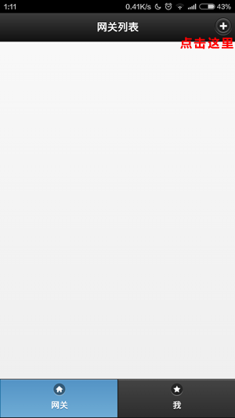
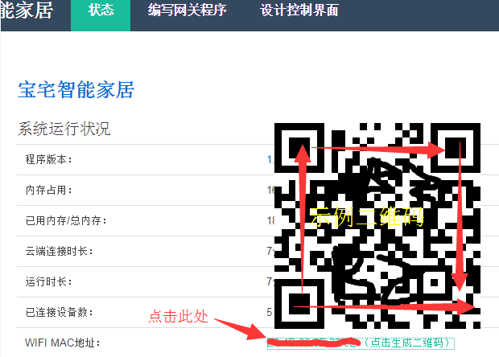
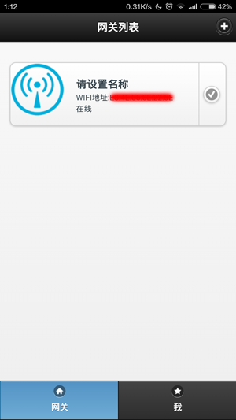
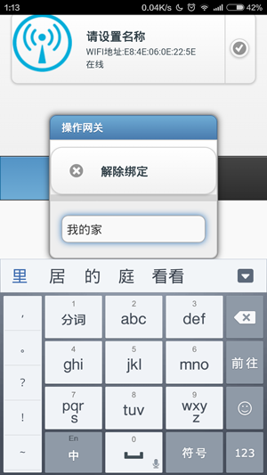
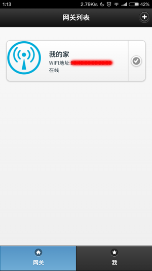

[网关程序开发](<doc/01.md>)  
[设备程序开发](<doc/02.md>)  
[手机控界面设计](<doc/03.md>)   
[关于未来](<doc/04.md>) 

#宝宅智能家居介绍

宝宅智能家居是一套简单、易用、开源的智能家居开发平台，宝宅智能家居为爱折腾的开发者们而生，目的是为了简化智能家居系统的开发复杂度，使开发者们可以将更多的精力放到智能家居功能本身的开发上来。  
首先，我们先来看下宝宅智能家居的架构图：

  
从图上可以看出宝宅智能家居由4部分组成，从左向右分别是“手机端”，“云端”，“家庭网关”和“终端设备”，下面我们先来简单了解下各个部分的作用：  
>* __“手机端”__ 经过“云端”同“家庭网关”进行通讯，用于实现对终端设备的监控和控制，在“手机端”上宝宅已经实现了账号登录、网络通讯等基础功能，开发者不需要在手机上做开发，只需要在“家庭网关”的“WEB版的集成开发环境”->“设计手机控制界面”里面，使用HTML/CSS来设计自己想要的界面和描述各个控件即触发动作即可。
>* __“云端”__ “手机端”与“家庭网关”之间的通讯桥梁，开发者不需要在此编写代码。
>* __“家庭网关”__ 扮演者整个系统的“大脑”的角色，主要代码在这里完成，通过“云端”桥接“终端设备”和“手机端”，也可以主动给“手机端”和“终端设备”发送指令。“家庭网关”是运行在树莓派上（也可以是其他ARM CPU的设备或PC机）的宝宅网关框架程序（基于Node.js开发），集成了WEB版的网关程序开发和手机控制界面设计环境, 宝宅已经封装好了主要的的核心的功能，开发者只需要编写少量的Javascript和HTML/CSS代码就可以实现网关程序的开发和手机控制界面的设计。
>* __“终端设备”__ 与“家庭网关”直接连接，可能是传感器也可能是需要控制的设备，MCU采用ESP8266 WIFI芯片，接入方便，价格便宜。另外基于Esp8266 for adrduino IDE开发环境+宝宅SDK，开发者无需了解具体的芯片原理和数据通讯过程，完全可以像开发arduino程序一样来编写ESP8266 上的程序。  

###宝宅智能家居开发导向图

##开始

###1.准备好一台树莓派
>* 从淘宝上购买一台树莓派，要求最低1代，同时请购买USB无线网卡和SD卡。
>* 将树莓派刷上Linux操作系统（一般默认安装 Debian linux操作系统），准备好一个干净的系统环境。
>* 将树莓派连接到互联网，建议配置静态IP，方便日后管理，开启telnet或ssh远程登录。

###2.运行一键安装程序，安装宝宅网关框架程序
	curl http://res.baozhai.cc/install.sh | sh

当显示如下内容时表示已安装成功  

	start server  
	baozhai pid is 25042  
	Install finish!  

###3.打开浏览器（建议使用chrome浏览器）访问 http://你的树莓派IP/   
进入宝宅智能家居管理系统的登录界面：

输入密码“admin”，登录进去：

###3.申请宝宅账号
请将WIFI MAC地址和你的email账号，邮件发送chzhewl@126.com，并简述您的想法，审核通过后，会邮件回复您。WIFI MAC地址用于将网关在云端注册，email账号会作为手机端登录云端的账号。

###4.手机客户端绑定网关
收到回复邮件后，接下来就可以开始将手机绑定网关了，请使用下述方法在手机上运行宝宅智能家居手机端程序.
>如果您是安卓手机请扫描下面的二维码下载安装安卓客户端，如果您不是安卓手机，宝宅提供了HTML5版的客户端，在浏览器中输入[http://w.baozhai.cc](http://w.baozhai.cc) 打开HTML5版客户端（如您是苹果设备建议使用此方式）。   
>__注：安卓客户端比HTML5版具有如下优势：__  
>1.扫描二维码绑定网关(详见下文)   
>2.接收来自网关的推送消息，可以用来实现预警功能。
>   
>安卓包下载二维码    
>

1.使用审核通过后邮件回复的账号和密码登录到云端  
  
2.登录后，在“网关列表”页面上点击右上角的加号按钮进入“网关绑定”页面  
   
3.回到PC浏览器上，在“状态”页中“WIFI MAC地址”后面选择“点击生成二维码”，这时系统会为MAC地址生成一个二维码，然后在回到手机上的“绑定网关”页面，如果是安装的安卓客户端在页面上会有一个“扫一扫”按钮，点击扫描二维码，扫描成功后MAC地址会自动显示到输入框里，如果是HTML5版，可以通过微信扫描后将MAC地址复制到输入框里。

网关界面  
 

手机界面    
  
4.点击“绑定”按钮，这时绑定请求已经转发到了网关侧，回到PC浏览器的“状态”页面上，查看下方的“网关绑定”的按钮已经变为可点状态，点击来确认本次绑定，这时手机上会自动完成绑定，并回到“网关列表”页面，此次绑定完成。

PC浏览器上，点击下面的按钮同意本次绑定  
  

手机上绑定成功界面  
  
5.点击刚刚绑定好的网关项右侧的对勾按钮，在弹出的对话框中为当前网关定义一个名称，点击任意位置确定名称修改，至此网关绑定结束。  
  

#继续
[网关程序开发](<doc/01.md>)  
[设备程序开发](<doc/02.md>)  
[手机控制界面设计](<doc/03.md>)   
[关于未来](<doc/04.md>) 

