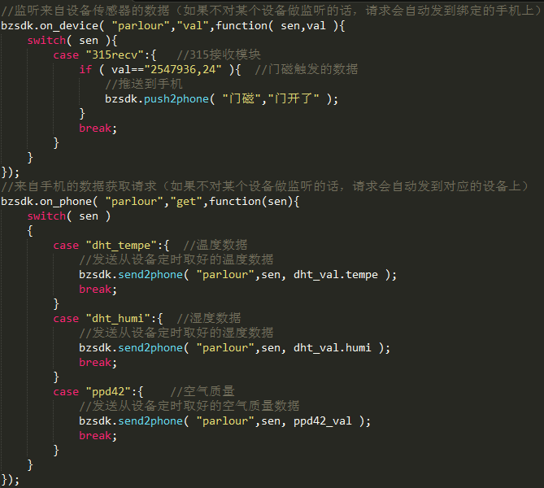

* [准备工作](<doc/00.md>)   
* [网关程序开发](<doc/01.md>)  
* [设备程序开发](<doc/02.md>)  
* [手机控界面设计](<doc/03.md>)   
* [关于未来](<doc/04.md>) 

#宝宅智能家居介绍

宝宅智能家居是一套简单、易用、开源的智能家居开发平台，宝宅智能家居为爱折腾的开发者们而生，目的是为了简化智能家居系统的开发复杂度，使开发者们可以将更多的精力放到智能家居功能本身的开发上来。  
首先，我们先来看下宝宅智能家居的架构图：

  
从图上可以看出宝宅智能家居由4部分组成，从左向右分别是“手机端”，“云端”，“家庭网关”和“终端设备”，下面我们先来简单了解下各个部分的作用：  
>* __“手机端”__ 经过“云端”同“家庭网关”进行通讯，用于实现对终端设备的监控和控制，在“手机端”上宝宅已经实现了账号登录、网络通讯等基础功能，开发者不需要在手机上做开发，只需要在“家庭网关”的“WEB版的集成开发环境”->“设计手机控制界面”里面，使用HTML/CSS来设计自己想要的界面和描述各个控件即触发动作即可。
>* __“云端”__ “手机端”与“家庭网关”之间的通讯桥梁，开发者不需要在此编写代码。
>* __“家庭网关”__ 扮演者整个系统的“大脑”的角色，主要代码在这里完成，通过“云端”桥接“终端设备”和“手机端”，也可以主动给“手机端”和“终端设备”发送指令。“家庭网关”是运行在树莓派上（也可以是其他ARM CPU的设备或PC机）的宝宅网关框架程序（基于Node.js开发），集成了WEB版的网关程序开发和手机控制界面设计环境, 宝宅已经封装好了主要的的核心的功能，开发者只需要编写少量的Javascript和HTML/CSS代码就可以实现网关程序的开发和手机控制界面的设计。
>* __“终端设备”__ 与“家庭网关”直接连接，可能是传感器也可能是需要控制的设备，MCU采用ESP8266 WIFI芯片，接入方便，价格便宜。另外基于Esp8266 for adrduino IDE开发环境+宝宅SDK，开发者无需了解具体的芯片原理和数据通讯过程，完全可以像开发arduino程序一样来编写ESP8266 上的程序。  

###宝宅智能家居开发导向图

###网关程序开发示例  

###设备程序开发示例  

###手机界面设计示例  

#继续
* [准备工作](<doc/00.md>)   
* [网关程序开发](<doc/01.md>)  
* [设备程序开发](<doc/02.md>)  
* [手机控界面设计](<doc/03.md>)   
* [关于未来](<doc/04.md>) 
